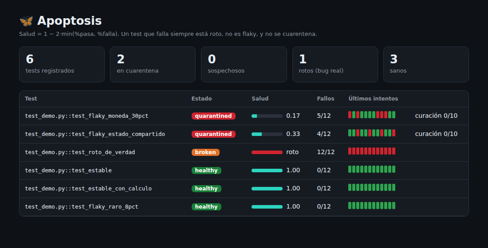

# 🦋 Apoptosis

**A Pytest plugin that kills flaky tests before they kill your pipeline.**
It runs each test N times with different seeds, computes a **health index**, and when a test drops below the threshold it **quarantines** it (marked *skipped*), **opens a GitHub Issue** with the failure history, and **reintegrates it automatically** only after 10 consecutive passes.




Inspired by apoptosis: programmed cell death removes damaged cells to protect the organism.
Examples: [`docs/report.html`](docs/report.html) · [`docs/issue-ejemplo.md`](docs/issue-ejemplo.md) (the issue it would open).

## Quickstart

```bash
# Linux/macOS: use python3 if `python` doesn't exist; on Ubuntu/Debian:
#   sudo apt install python3-venv python3-pip
python3 -m venv .venv && source .venv/bin/activate    # Windows: .venv\Scripts\activate
pip install -e .

cd examples/flaky_demo
pytest --apoptosis-runs 12                 # 1) scan: each test 12 times with different seeds
pytest --apoptosis                         # 2) normal pipeline: flaky ones show as "skipped"
apoptosis status                           # 3) health table  (apoptosis report → HTML dashboard)
pytest --apoptosis-heal                    # 4) healing: reintegrate after 10 consecutive passes
```

The plugin is **opt-in**: without `--apoptosis` (or `--apoptosis-runs`/`--apoptosis-heal`, or `apoptosis = true` in the ini) it does nothing.

## How it decides (the important part)

```
health = 1 − 2·min(%pass, %fail)        1 failure in 10 → 0.80 · 2 → 0.60 · 3 → 0.40 · 5 → 0.00
```

| State | Condition | Killed? |
|---|---|---|
| `healthy` | never failed | no |
| **`broken`** | **always** fails | **no**: it's a real bug — the test is doing its job |
| **`changed`** | a single pass→fail (or fail→pass) switch | **no**: regression or fix, not flakiness |
| `suspect` | oscillating (≥ 2 switches) but health ≥ threshold | no, kept under watch |
| **`flaky`** | oscillating (≥ 2 switches) and health < threshold (0.75) | **yes** |
| `learning` | fewer than 10 attempts | not judged yet |

Telling *flaky* apart from *broken* is what avoids the classic mistake of "quarantining a test because it fails" and hiding a real bug.

```
pytest ─▶ runs each test N times (seed base+i, fixtures rebuilt, random/numpy seeded)
      ─▶ events.jsonl (append-only: safe with xdist, versionable, cacheable in CI)
      ─▶ health ─▶ flaky? ─▶ kill ─▶ skip in the pipeline + GitHub issue (or local .md) with history & how to reproduce
      ─▶ pytest --apoptosis-heal ─▶ 10 consecutive passes (a failure resets the streak) ─▶ release ─▶ closes the issue
```

If the test breaks again after being reintegrated, the **same issue is reopened** (no duplicates). If GitHub is down, the pipeline **doesn't break**: the issue stays pending and is created on the next run.

## Verified results

**Test suite:** 44 tests (unit + full end-to-end scenarios with `pytester`: kill → skip → heal → reopen issue, xdist with 2 workers, GitHub down) — all passing.
**Verified environment:** Ubuntu 24.04, Python 3.14, pytest 9.1.1.

Real demo run (`examples/flaky_demo`, scan with 12 seeds):

```
🦋 quarantined: test_flaky_moneda_30pct        (health 0.00, 6/12 failures)
🦋 quarantined: test_flaky_estado_compartido   (health 0.33, 4/12 failures)
   broken:      test_roto_de_verdad            (12/12 failures — NOT quarantined, kept red)
   healthy:     test_estable, test_estable_con_calculo
→ pipeline: 1 failed (the real bug), 3 passed, 2 skipped
```

**Observed across two independent runs:** the subtle 8%-flaky test was flagged `suspect` in one run (1/12 failures) and `healthy` in another (0/12). That's not a bug — it's exactly what the simulation below predicts: a single 12-run scan only catches an 8% flaky about a quarter of the time.

**Manual mutation check:** I deliberately broke 6 key behaviors (killing broken tests, not reintegrating, not resetting the streak, duplicate issues, killing regressions, same seed every attempt). The suite caught five; **one survived** (comment spam on the issue) → I hardened the test and it catches it now.

**How flaky does a test have to be before it dies?** Monte Carlo simulation over the real decision function (2000 trials per cell, `python scripts/simulate.py`):

| true failure rate | 10 attempts (1 scan) | 30 attempts (3 scans) | 30 attempts, threshold 0.90 |
|---|---|---|---|
| 0 % | 0 % | 0 % | 0 % |
| 2 % | 1 % | 0 % | 12 % |
| 5 % | 8 % | 6 % | 43 % |
| 10 % | 25 % | 33 % | 81 % |
| 15 % | 44 % | 68 % | 95 % |
| 20 % | 60 % | 88 % | 99 % |
| 30 % | 83 % | 99 % | 100 % |
| 50 % | 96 % | 100 % | 100 % |
| 100 % (broken) | 0 % | 0 % | 0 % |

**Honest reading:** with the defaults, Apoptosis reliably catches "obvious" flaky tests (≥ 20% failure rate within 3 scans) and **barely sees the subtle ones** (2–5%): the 0.75 threshold is equivalent to ~12% true failure rate. Catching the subtle ones requires raising the threshold (0.90) and accepting more false positives. A healthy test is never killed (0% in the first row) and neither is an always-broken one (last row), by design.

## Options

| Flag / ini | Default | |
|---|---|---|
| `--apoptosis-runs N` | 1 | repetitions per test, with seeds `seed, seed+1, …` |
| `--apoptosis-seed S` | random | reproduce a failure: the issue lists the failing seeds |
| `--apoptosis-threshold` | 0.75 | minimum health |
| `--apoptosis-min-attempts` / `--apoptosis-window` | 10 / 30 | how much data is needed / how many recent attempts count |
| `--apoptosis-heal` / `--apoptosis-heal-passes` | – / 10 | healing mode |
| `--apoptosis-github-repo` | `$GITHUB_REPOSITORY` | token in `$GITHUB_TOKEN` or `$APOPTOSIS_GITHUB_TOKEN` |
| `--apoptosis-no-issues` | – | local files only, in `.apoptosis/issues/` |
| `--apoptosis-dir` | `.apoptosis` | state directory |

Everything has a `pytest.ini` equivalent (`apoptosis_runs = 10`, …). Mark `@pytest.mark.apoptosis_immune` for tests that must never be quarantined (still measured and reported). The `apoptosis_seed` fixture exposes the current attempt's seed. CLI: `apoptosis status | report | release NODEID | compact`.

Typical CI usage: nightly scan (`--apoptosis-runs 10`) + normal pipelines with `--apoptosis`. Ready-made example: [`examples/github-actions/apoptosis.yml`](examples/github-actions/apoptosis.yml).

## Limitations (read before adopting)

- **The GitHub integration has only been tested against a local fake server**, not real GitHub. It's the part most worth verifying in your repo (`issues: write` permission, labels).
- Tested with **Python 3.12–3.14 and pytest 9.1.1**.
- Re-running a test **in the same process** exposes state shared between repetitions (globals, singletons): sometimes that *is* the bug, but a non-idempotent test can look flaky without being flaky. Read the issue history before blaming the test.
- `--apoptosis-runs N` multiplies execution time by N: meant for a nightly job, not every commit.
- Failure messages (first 300 chars) go into the issue: **don't use it on public repos if your asserts might print secrets**.
- Failures are modeled as independent; flakiness correlated with time of day or with another test is not detected.
- Pytest tests only (`unittest.TestCase` untested). No live dashboard or Slack integration.

## What I learned building it

- "Fails = flaky" is a trap: I separated *broken*, *regression* and *flaky*, with a unit test per case.
- Two runs of the same demo can classify the subtle 8%-flaky test differently (`suspect` vs `healthy`) — single scans are weak evidence; the health history across runs is what matters.
- The mutation check caught me being overconfident: one deliberately-broken behavior (issue comment spam) survived the whole suite until I wrote a specific test for it.

## Structure

```
apoptosis/    plugin · health · store · issues · github · report · cli
examples/     flaky_demo (6 demo tests) · github-actions/apoptosis.yml
tests/        44 tests (unit + pytester scenarios)     scripts/simulate.py (Monte Carlo)
docs/         sample dashboard + sample issue
```

MIT © Selinne Carlin
